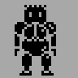

[Раньше](2019.11.25.md)  
## Утро
Делал малому завтрак. Подробности не помню, возможно была только каша.

Ещё были некие душеспасительные действия. То-ли книжку почитал, то-ли отказался от интернета, то-ли мысль какя-то умная пришла.

Подробностей не помню.
## Работа
Очень плохо, что я заполняю дневник по ходу действия, это избавляет меня от процесса обдумывания произошедших событий и сложившийся ситуации.

Придя на работу исправил пару косяков в акции, он были связаны с выгрузкой цен. Моей вины здесь не было, с моей стороны всё отработало как часы.

Первую половину дня занимался фигнёй. Затем пообедал сендвичами и лёг спать.

Разбудил меня Попов.

Пока обедал, прочитал пост на Хабре о создании SimCity. В посте было упоминание о том, что программист вдохновлялся работами Джея Форрестера "Динамика развития города". Меня этот автор заинтересовал. Чувак из 60х, с плодотворными концепциями. Это то, что мне нравится.

Нашёл его книгу "Динамика развития города" от издательства "Прогресс" 1973 г. в русском переводе. Книгу пока только пролистал, но увиденное меня уже впечатлило.  
Как раз в тему моделирования соц. процессов.

Также у этого автора, в русском переводе, есть "Мировая динамика", к сожалению с комментариями Переслегина.

Смотрел видео в ютубе, наконец принялся за оформление фильтра.

Даже попытался немного порисовать.  
Не знаю, зря это было или нет.
## Путь домой
Шёл пешком.

Будучи в автобусе загрузил пару пару приложений для пиксельарта на телефон.
## Дома
В попыхах сделал с малым английский.
Поужинал.

*Дополню запись позже.*

Ещё домой доставили книги заказанные на Озоне.

Пока малой засыпал, я решил заняться пиксельартом на телефоне. Стал разбираться с приложениями скачанными ещё в автобусе.  
Первое приложение отбросил, т.к. там не быо слоёв и нельзя было задавать палитру в hex'ах, второе оказалось получше.

Результат получился так себе.  

Краткий выводы:  
- Если хочешь делать 1bit графику, a'la spectrum, неободимо её делать на чёрном фоне белым цветом. Вариант для подземелья. Ну и чёрным по белому, когда персонажи из этого подземелья выбираются.
- Голова для чибика получилась слишком маленькая, в примерах, для такого типа графики тело персонажа рисуется десятком пикселов, не больше. Даже возможны случаи, когда тела у всех персонажей одинаковы, отличаются только головы.
- Отрисовка персонажей для одномерной поверхности (когда они могут перемещаться вправо и влево) и для двумерной (бегают по изометрии в 2d) - отличается и довольно существенно
- Нужно соотносить размеры персонажей и игровое поле, как минимум нужно смотреть, сколько фигур поместится по горизонтали и по вертикали.

После этого полез на пинтерест смотреть варианты однобитной графики.

По крайней мере, пока возился со всей этой фигнёй, придумал концепцию геймплея. Согласно этой концепции, мне нужна изометрия.

[Дальше](2019.11.27.md)