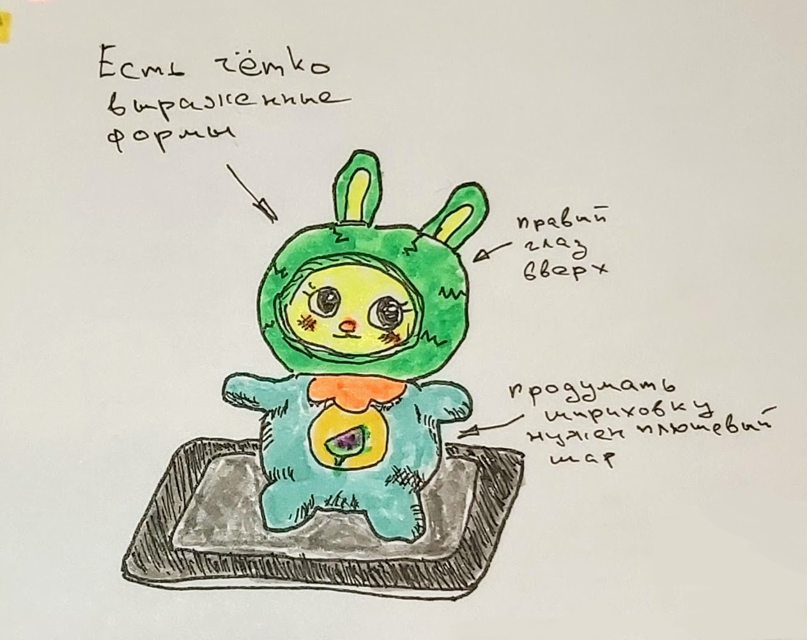
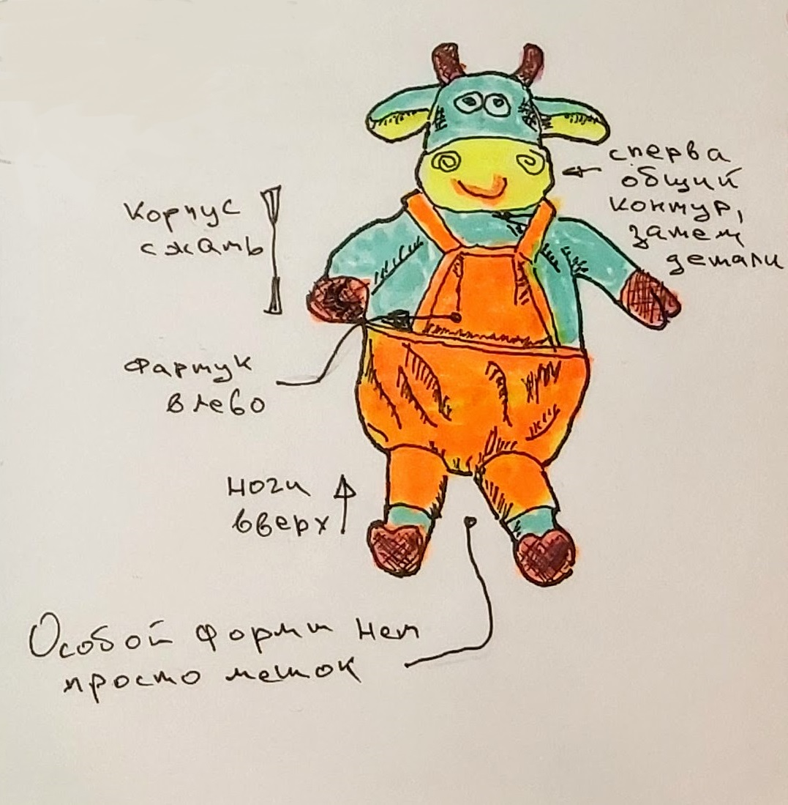

[Раньше](2021.01.03.md)  
## Утро
Спали плохо.

Поднялись во время.

Привели себя в порядок, позавтракали мелочью и поехали доставлять больного на перевязку.
## День
Моё участие понадобилось в связи с тем, что Андерей на костылях и понадобилась некая физическая сила.

Забрали его в 9:30. Перевязка в 10 или 10:30. В 11:00 были дома.

Дети ещё не поднялись.  
Вызвонили Ольгу, она сказала, что скоро приедет и делать завтрак для Сони не обязательно.

Сделал салаты для своих.  
Ольга приехала и забрала ребёнка.  
Мы спокойно позавтракали я же потупил и взялся за ежедневник и дневник.

В ежедневнике заполнил содержание. В дневнике сделал записи за два дня.  
Пожалуй сейчас я в ежедневнике оставлю место для годовых итогов и сделаю записи для текущего месяца.

Помимо ежедневника, сделал таблицу с расходами за текущий год. Внёс свои расходы за прошлый и текущий месяцы.

Пока я занимался всей этой фигнёй, Нелли разрисовывала дудлы. В процессе разрисовывания она решила, что ей не хватает маркеров.

Потупил в твиттере, помыл посуду и мы поехали за новыми маркерами.  
Маркеры купили в Магазинах радости.

Затем съездили в "Канцелярскую крысу", где я взял пару оставшиихся пастельных маркеров от stabilo и два линера по .1 и .3. Мне совсем не понравилось поведение моих маркеров.

Потом навестили продуктовые магазины, где я в очередной раз взял компонентов для завтрашнего салата и, неожиданно для себя, взяли стейк.

Вернувшись домой, поужинали и порисовал.  
Получилось вроде неплохо.  
  
  
У ЕФ получился классный стейк.
## Вечер
Помыл посуду.

Прошёл один урок по английскому.

Посмотрел с малым одну серию сериала "Стража" по Терри Прачету.

Заполнил дневник. Нужно ещё зубы почистить.
[Дальше](2021.01.05.md)
